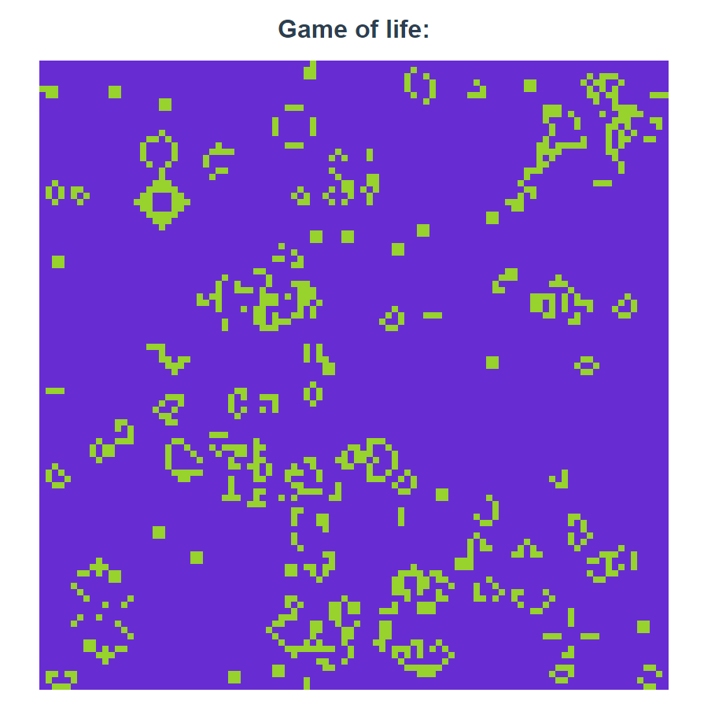

# Conway's Game of Life
A fun weekend programming challenge to make Conway's game of life with vanilla javascript and HTML5 Canvas.

## Summary
* Any live cell with fewer than two live neighbours dies, as if by underpopulation.
* Any live cell with two or three live neighbours lives on to the next generation.
* Any live cell with more than three live neighbours dies, as if by overpopulation.
* Any dead cell with exactly three live neighbours becomes a live cell, as if by reproduction.



## To run and develop with

```bash
# Clone this repository
git clone https://github.com/jhynes94/conway-game-of-life
# Go into the repository
cd conway-game-of-life
# Install dependencies
npm install
# Run the app
npm run dev
```